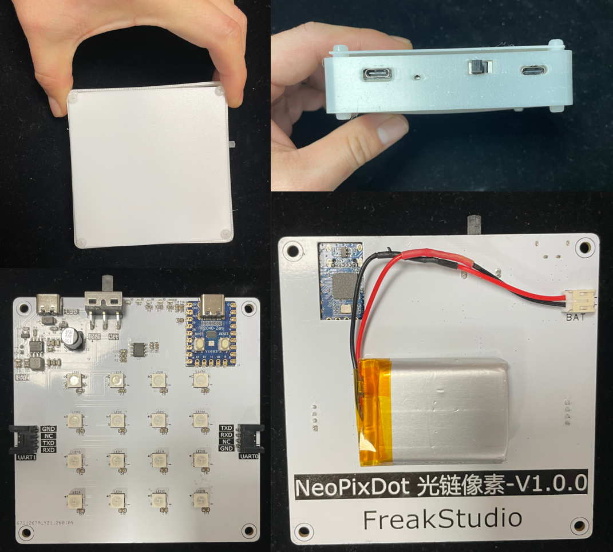
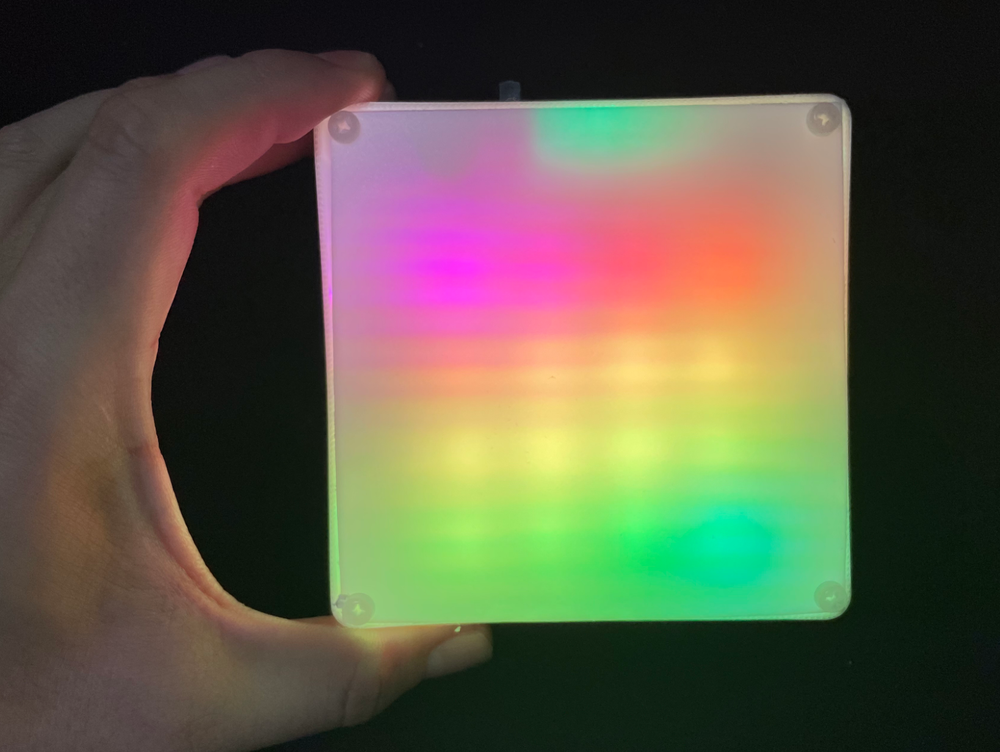

# NeoPixDot 光链像素产品说明文档

# **一、产品简介**

一款带独立供电系统的级联式 WS2812 像素模拟模块，专为解决 WS2812 协议长距离/大尺寸传输不稳定问题设计，支持脱线独立工作，可级联拼接成超大尺寸 WS2812 显示屏幕。

**仓库地址：[https://github.com/FreakStudioCN/NeoPixDot](https://github.com/FreakStudioCN/NeoPixDot)**

# **二、核心特性**

## **2.1 硬件特性**

- **主控核心**：RP2040 系列芯片，高性能且适配 MicroPython 开发
- **显示单元**：4x4 矩阵 WS2812 RGB 灯，搭配均光膜呈现“单个像素点”视觉效果
- **供电系统**：板载 IP5407 充放电单元 + 锂电池，支持 USB 充电/电池供电自动切换
- **级联设计**：双串口按“移位传输”逻辑级联，支持多模块拼接扩展

## **2.2 软件特性**

- **UART 数据处理**：解析 RGB 数据控制 WS2812 灯带，自动转发剩余数据至下一级模块
- **电池监测**：ADC 采集电池电压 + 滑动滤波算法，低电压时红灯闪烁告警并禁用 UART 控灯
- **稳定保障**：集成看门狗（WDT）定时喂狗防程序卡死，环形缓冲区 + 中断安全调度确保 UART 数据传输稳定
- **灯效支持**：正常电压下自动执行彩虹流动灯效，低电压触发红灯闪烁告警
- **调试友好**：可配置调试打印开关，计时装饰器辅助性能分析

# **三、硬件说明**

# **四、软件说明**

## **4.1 核心功能逻辑**

1. **UART 级联传输**：主控发送全量像素数据，模块解析自身 RGB 信息后，转发剩余数据至下一级
2. **电池电压监测**：100ms 周期采样电压，5 次滑动滤波去噪，低电压（3.4V）时红灯闪烁，禁用 UART 控灯；电压恢复后自动解除限制
3. **看门狗保障**：5 秒超时看门狗，1 秒周期定时喂狗 + 主循环喂狗，防止程序卡死
4. **灯效控制**：上电检测电压正常则执行彩虹流动灯效，低电压触发红灯闪烁，支持 UART 解析 RGB 数据实时控灯

## **4.2 代码关键模块**

- `RingBuffer`：环形缓冲区，解决 UART 数据接收满/空歧义问题，保障中断上下文数据安全
- `read_battery_adc`：电池电压采样 + 滑动滤波，提升电压检测稳定性
- `uart_idle_callback`：UART 空闲中断回调，接收数据并调度处理逻辑
- `rainbow_flow`：彩虹流动灯效实现，长操作前手动喂狗避免看门狗超时
- `wdt_feed_callback`：看门狗喂狗回调，定时重置超时计数器

## **4.3 文件功能介绍**

| 文件名               | 核心功能说明                                                                                              |
| -------------------- | --------------------------------------------------------------------------------------------------------- |
| config.py            | 全局配置中心，定义所有可配置参数（波特率、ADC 阈值、灯效参数、缓冲区大小等），统一管理常量和全局变量      |
| ring_buffer.py       | 实现中断安全的环形缓冲区类，解决 UART 中断接收数据的缓存问题，预留 1 字节避免满 / 空状态歧义              |
| utils.py             | 通用工具函数封装，包含调试打印（可控开关）、函数计时装饰器（辅助性能分析）                                |
| core_protected.py    | 核心业务逻辑实现，涵盖 WS2812 灯效控制、电池电压采样 / 滤波、UART 数据解析 / 转发、看门狗喂狗、中断回调等 |
| main.py              | 程序入口，完成初始化（定时器 / UART / 看门狗）、上电电压检测、主循环（电压监测 / 状态切换 / 喂狗）        |
| pico_mpy_uploader.py | 编译 & 上传工具，自动将非 main.py 文件编译为 mpy（节省闪存 + 提升执行效率），通过 mpremote 上传至 Pico    |

# **五、使用方法**

## **5.1 供电**

- USB 充电：通过 USB 接口为锂电池充电，IP5407 自动管理充放电
- 电池供电：脱线状态下由锂电池供电，支持独立工作

正常上电情况下，有彩虹效果：

**若是电量不足，则整个装置红灯闪烁。**

## **5.2 模块级联**

- 将前一级模块的 UART 转发口（UART1）连接至下一级的 UART 接收口（UART0）
- 主控发送全量像素数据，每个模块自动解析自身 RGB 数据，转发剩余数据至下一级

## **5.3 数据传输**

- UART 波特率：115200
- 数据格式：前 3 字节为当前模块 RGB 值，剩余字节为下一级模块数据
- 示例：发送 `0xFF000000FF00`，第一个模块显示红色，第二个模块显示绿色

# **六、注意事项**

1. 电池低电压阈值为 3.4V，低电时请及时充电，避免损坏电池
2. 调试模式可通过 `DEBUG_ENABLE` 开关开启/关闭，上线建议关闭以节省资源
3. 长耗时操作（如彩虹灯效、上电电压检测）会手动喂狗，避免看门狗超时重启

# 七、仓库文件介绍

# 版本记录

| **版本号** | **修改人员** | **时间**   | **内容**     |
| ---------- | ------------ | ---------- | ------------ |
| v1.0       | 李子圣       | 2026/01/28 | 初始化文档。 |
|            |              |            |              |
|            |              |            |              |
|            |              |            |              |
